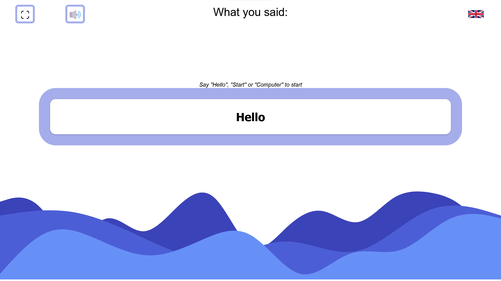
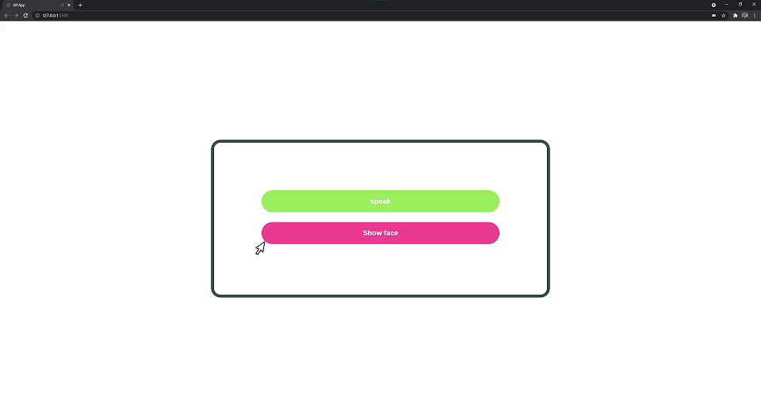
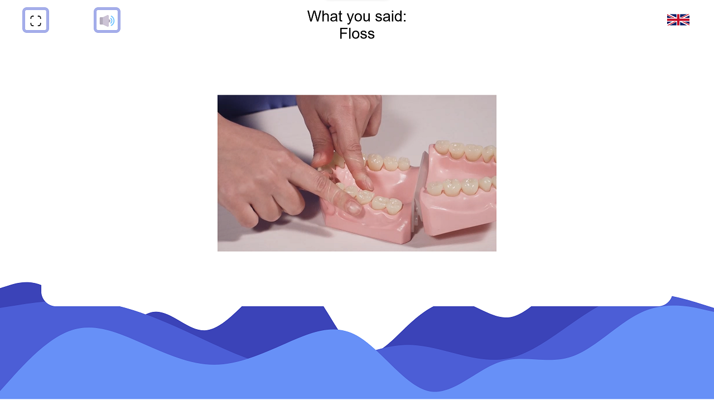

# alf_frontend
Interaction app for alf robot

## Must run on Chrome with flag --autoplay-policy=no-user-gesture-required 

## Files

### alfApp.js
- Main logic 
### speech.js
- Contains code for tts & stt
### tree.js
- Code for the interaction tree
### Alf_frontend.txt
- Developer thoughts and musings
### index.html
- index.html

## Preview

### Start

### Face detection buttons

### Question interface

### video modal

