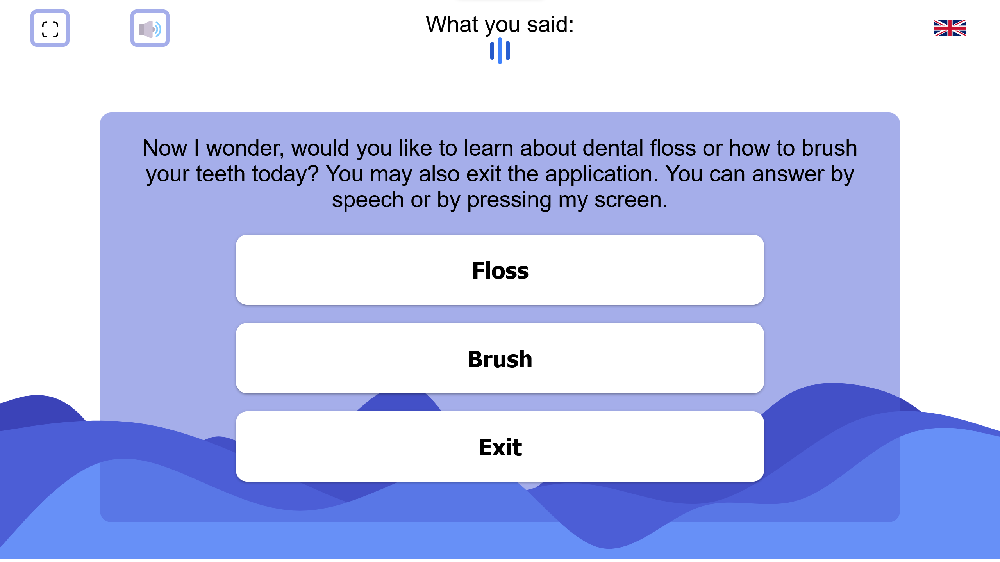
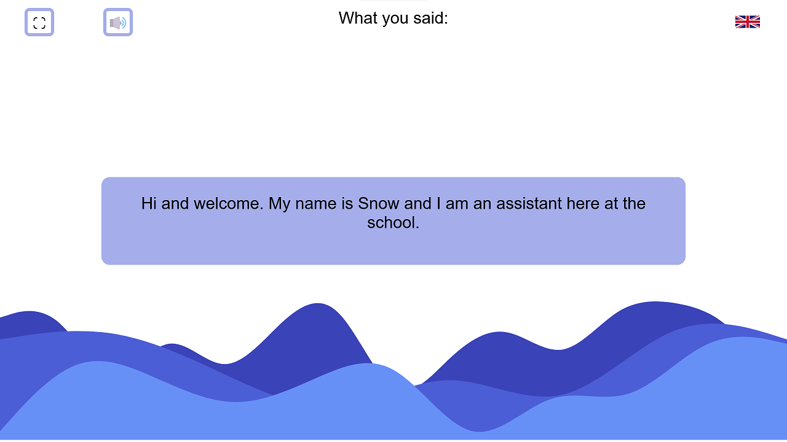
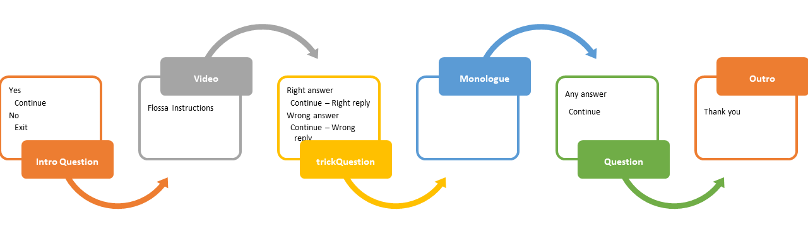

# Flossa V2 Webinar Snaphot

Dual language interaction app for Flossa V2, using Coqui-ai STT on Snow


## Preview





## Files

### index.html
- index.html

### main.js
- Main logic

`nodeStart()`, loops nodes from *tree.js*, starting with `rootNode`

-   `currentNode` keeps track of active node
-   Child-nodes are set on parent-node to progress interaction
-   Each dialogue goes through textToSpeech() in *speech.js* to query for audio files.
-   ~~Recording is controlled with `isRec()` variable.~~
    - Audio user input is handled with **webRTC && Coqui-ai**
    - User input outside scope of childnodes gets passed through `nodeStart()` with `currentNode`
-   Depending on class and user input, childnode is set to `currentNode`.
-   New `currentNode` is activated with `nodeStart()`
-   Tree ends with node class `EndTree`

When node has been passed through tts it goes to
- interaction()
  - interaction handles node based on class and forwards to appropriate functionality


### text_swe.js & text_eng.js
- Holds all text as dictionaries that are used in tree.js
### tree.js
- Code for the interaction tree with 5 node classes
- All nodes but Video class requires a string for tts
- Make a parent node, then create the child node
- Then set the child node on the parent node
  - Question
    - Takes between 2-3 answers for a question
    - Set child nodes with setNodes
  - trickQuestion
    - Takes between 2-3 answers for a question
    - Set child node with setNextNode
  - Monologue
    - Only tts
    - Set child node with setNextNode
  - Video
    - Plays a video in a Modal
    - Can start and stop video on custom timers
    - Set child node with setNextNode
    - If give tts
      - Mutes video and talks
    - Else video plays with sound
  - EndTree
    - Class that ends the interaction
- Current node tree layout


### speech.js
- Contains code for tts & stt
- Forwards all classes but Video to next node and calls for recording
### interface.js
- Interface scripts
  - For example: toggle full screen, hide buttons or video modal
### ~~gesture.js~~
- ~~List of emotes and gesures~~
- ~~Function for sending gestures to SSE backend~~
- Remove? soon&trade;
### webRTC/
- Audio recording using webRTC files
- Soundmeter to gauge sound volume
- audio.js calls checkUserInput for Question and trickQuestion node classes to forward next node
### media/
- video tutorial and images
## Flow diagram
Shows how the application and its surrounding systems work in conjunction.
- Coming soon&trade;

## GenerateTree Node types
**monologue**
```
{
	type: "monologue",
	sentence: "foobar",
	nextNode: {
		...
	},
}
```
**question**
answer and node C optional
```
{
	type: "question",
	sentence: "foobar",
	answerA: "ansA",
	nodeA: {
		...
	},
	answerB: "ansB",
	nodeB: {
		...
	},
	answerC: "ansC",
	nodeC: {
		...
	},
}
```
**trickQuestion**
answer C optional
```
{
	type: "trickQuestion",
	sentence: "foobar",
	answerA: "ansA",
	answerB: "ansB",
	answerC: "ansC",
	nextNode: {
		...
	},
}
```
**monologue**
```
{
	type: "monologue",
	sentence: "foobar",
	nextNode: {
		...
	},
}
```
**video**
```
{
	type: "video",
	sentence: "foobar",
	videoUrl: "url",
	videoDelayStart: 123,
	videoDuration: 123,
	nextNode: {
		...
	},
}
```
**reset**
```
{
	type: "reset",
	sentence: "foobar"
	nextNode? Name of node that was saved as a variable,
	or just first node in the tree?
}
```
