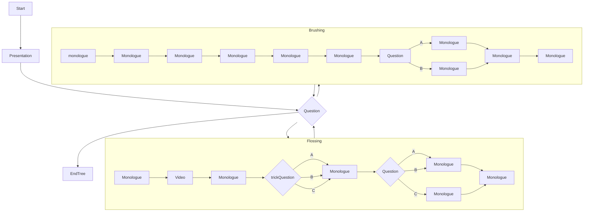
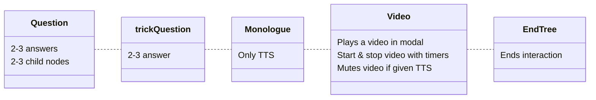

# Flossa V2

**Webapp using node-tree structure to interact and teach users how to use floss with Coqui-ai STT and Google TTS**
**Build for the MäRI project at Arcada 2022**

# Table of Contents

1. [Technologies](#technologies)
2. [Application function](#application-function)
    1. [Preview](#preview)
    2. [Interaction flowchart](#interaction-flowchart)
3. [Files](#files)
    1. [index.html](#indexhtml)
    2. [text.js](#textjs)
    3. [functions.js](#functionsjs)
    4. [tree.js](#treejs)
    5. [initiate.js](#initiatejs)
    6. [webRTC folder](#webrtc)
    7. [media folder](#media)
    8. [style.css](#stylecss)
4. [Project status](#project-status)
5. [Sources](#sources)
6. [Linked projects](#linked-projects)

# Technologies

- [HTML](https://developer.mozilla.org/en-US/docs/Web/HTML)
- [CSS](https://developer.mozilla.org/en-US/docs/Web/CSS)
- [JS](https://developer.mozilla.org/en-US/docs/Web/JavaScript)
- [WebRTC](https://webrtc.org/)
- [Socket.IO](https://socket.io/)
- [Google-TTS](https://cloud.google.com/text-to-speech)
- [WebRTC](https://webrtc.org/)
- [Coqui-ai/STT](https://coqui.ai/)

# Application function
The application runs on Arcada robot Snow. The purpose is to instruct users about dental hygiene through flossing and brushing techniques with both text and speech. The speech is generated using [Google-TTS](https://cloud.google.com/text-to-speech) and for flossing a video is also showing for clarity.

The user may select which techniques to learn about using touch inputs or speech. The speech input is handled with [WebRTC](https://webrtc.org/) and is converted to plain text using [Coqui-ai](https://coqui.ai/).

After instructions the users is prompted with questions that should be answered using touch or speech. Finally the user may choose to learn more or exit the application.

## Preview

## Interaction flowchart

# Files

## index.html
- Framework for holding application
- Holds "wavey" design in footer
- imports all scripts

## text.js
- Objects for text to the application, used primarily in *tree.js*
- Available manuscripts are in english and swedish

## functions.js
- Stores all main functions, outside of [STT](#webrtc "see webRTC/audio.js")

Functions of note:

### createSpeechFunction()
- TTS API uses SSML so the text should be within \<speak> tags
- textToSpeech uses the variable context and calls on the function playAudio which the function "remembers" i.e. Closure
- Returns a function called textToSpeech that we can save to a variable and call when needed.

### nodeStart(), loops nodes from *tree.js*, starting with `rootNode`
-   `currentNode` keeps track of active node
-   Child-nodes are set on parent-node to progress interaction
-   Each dialogue goes through textToSpeech() in *speech.js* to query for audio files.
    - Audio user input is handled with **webRTC && Coqui-ai**
    - User input outside scope of childnodes gets passed through `nodeStart()` with `currentNode`
-   Depending on class and user input, childnode is set to `currentNode`.
-   New `currentNode` is activated with `nodeStart()`
-   Tree ends with node class `EndTree`
	- `EndTree` refreshes page with reload.

### interaction()
  - When a node has been passed through TTS it goes to interaction that handles node based on class and forwards to appropriate functionality

### checkUserInput()
  - Gets result from [STT](#webrtc "see webRTC/audio.js") or user touch input and sets next node depending on answer

## tree.js
Code for the interaction tree with 5 node classes.

### To build a tree:
- First make a parent node
- Then create the child node
- Finally set the child node on the parent node
- Additional parameters, like video, set as needed
- All nodes but `Video` class **requires a string** for tts

## initiate.js
- Initiates the app and sets up the application
- **import after** other scripts but before webRTC module

## webRTC/
- soundmeter.js to gauge sound volume
- audio.js for handling mic and TTS
- socket.io implementation to stream audio to interpreting server

## media/
- video tutorial
- images

## style.css
- Styling and animations

# Project status

Finalized
- [V1](https://github.com/socbots/flossa-webapp/tree/version-1) for robot Alf with gestures
- V2 for robot Snow (current)

# Linked projects

[socbots/tts-stt-api](https://github.com/socbots/tts-stt-api)

[socbots/coqui-websocket](https://github.com/socbots/coqui-websocket)

[socbots/sse-backend](https://github.com/socbots/sse-backend)

[socbots/kaldi-web](https://github.com/socbots/kaldi-web)

[Blog@Amy&Alf.fi](https://amyandalf.fi/)