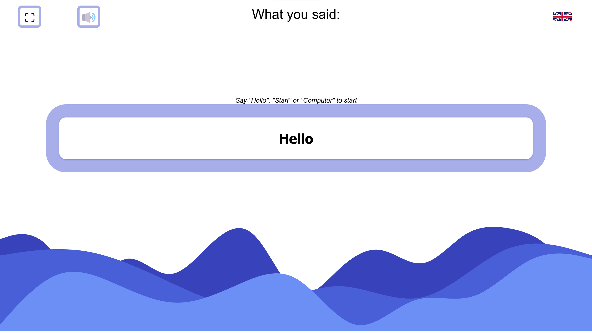
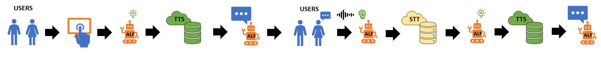

# alf_frontend
Interaction app for alf robot

 App must be run in Firefox 
## Preview

## Files

### index.html
- index.html

### main.js
- Main logic

`startDialogue()`, loops nodes from *tree.js*, starting with `rootNode`

-   `currentNode` keeps track of active node
-   Child-nodes are set on parent-node to progress of interaction
-   Each dialogue goes through textToSpeech() in *speech.js* to query for audio files.
-   Recording `isRec()` sets to true as dialogue finnishes.
-   Depending on user input, selected childnode is then selected and `startDialogue()` begins again.
    - Audio user input is handled with **webRTC**
    - User input outside scope of childnodes gets passed through `startDialogue()` with `currentNode` and attribute `notUnderstood` set to True
-   Tree ends with node class `EndTree`

### text.js
- Holds all text as dictionaries that are used in tree.js
### tree.js
- Code for the interaction tree

The tree works by creating a node. Currently 2 class nodes are available, Question and EndTree:

- Current node tree layout

### speech.js
- Contains code for tts & stt
### interface.js
- Interface scripts
  - For example: toggle full screen, hide buttons or video modal
### gesture.js
- List of emotes and gesures
- Function for sending gestures to SSE backend
### webRTC/
- Audio recording using webRTC files
- Soundmeter to gauge sound volume

### media/
- video tutorial and images

### englishVersionResources/
- modified files to build an English version of the app
  - mainly url changes

## Flow diagram
Shows how the application and its surrounding systems work in conjunction.

## 3rd party services
The following services and applications are used to make the whole system work.

### TTS & STT
[Github](https://github.com/socbots/ALFTTSNuggPy)

Available on [heroku](https://alf-tts-api.herokuapp.com/)

- Uses google services for text-to-speech and speech-to-text
- Different ports for Swedish and English

Can also be run on local Raspberry

### SSE Backend
[Github](https://github.com/socbots/sse_backend)

Run on local Raspberry

- Stream to post movement commands for Mobile SDK

### Mobile SDK
[Github](https://github.com/socbots/MobileSDK)

Run from phone in virtualwing @Arcada

- Grants access to movements
- Listens to SSE stream for movement instructions
