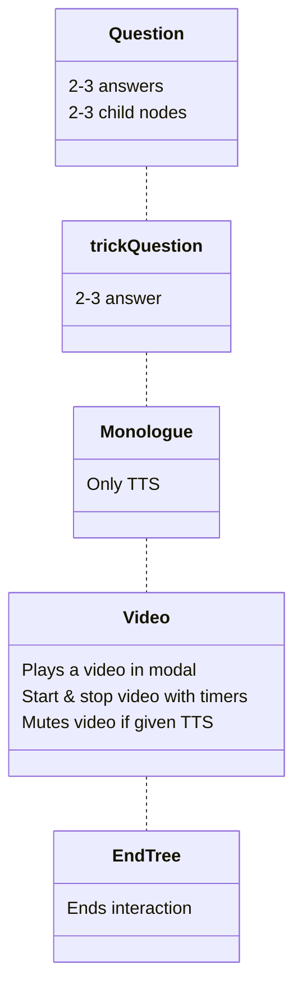

# Flossa V2
**Webapp using node-tree structure to interact and teach users how to use floss with Coqui-ai STT and Google TTS**
**Build for the [MäRI project](https://www.arcada.fi/sv/forskning/projekt/mari-manniska-robot-interaktion-den-sociala-roboten) at Arcada 2022**

# Table of Contents

Write a goal
Dual language interaction app for Flossa V2, using Coqui-ai STT on the robot Snow
summary stuff

# Preview

# Technologies

- [HTML](https://developer.mozilla.org/en-US/docs/Web/HTML)
- [CSS](https://developer.mozilla.org/en-US/docs/Web/CSS)
- [JS](https://developer.mozilla.org/en-US/docs/Web/JavaScript)
- [WebRTC](https://webrtc.org/)
- [Socket.IO](https://socket.io/)

# Scope of functionalities
asdasdasd

# Files

## index.html
- index.html 

## text.js
- Objects for text to the application, used primarily in *tree.js*

## functions.js
- Stores all main functions, outside of [STT](#webrtc "see webRTC/audio.js")

Functions of note:

### createSpeechFunction()
- TTS API uses SSML so the text should be within \<speak> tags
- textToSpeech uses the variable context and calls on the function playAudio which the function "remembers" i.e. Closure
- Returns a function called textToSpeech that we can save to a variable and call when needed.

### nodeStart(), loops nodes from *tree.js*, starting with `rootNode`
-   `currentNode` keeps track of active node
-   Child-nodes are set on parent-node to progress interaction
-   Each dialogue goes through textToSpeech() in *speech.js* to query for audio files.
    - Audio user input is handled with **webRTC && Coqui-ai**
    - User input outside scope of childnodes gets passed through `nodeStart()` with `currentNode`
-   Depending on class and user input, childnode is set to `currentNode`.
-   New `currentNode` is activated with `nodeStart()`
-   Tree ends with node class `EndTree`
	- `EndTree` refreshes page with reload.

### interaction()
  - When a node has been passed through TTS it goes to interaction that handles node based on class and forwards to appropriate functionality

### checkUserInput()
  - Gets result from [STT](#webrtc "see webRTC/audio.js") or user touch input and sets next node depending on answer

## tree.js
Code for the interaction tree with 5 node classes.

### To build a tree:
- First make a parent node
- Then create the child node
- Finally set the child node on the parent node
- Additional parameters, like video, set as needed
- All nodes but `Video` class **requires a string** for tts

## initiate.js
- Initiates the app and sets up the application
- **import after** other scripts but before webRTC module

## webRTC/
- soundmeter.js to gauge sound volume
- audio.js for handling mic and TTS
- socket.io implementation to stream audio to interpreting server

## media/
- video tutorial
- images

## style.css
- Styling and animations

# Examples of use

# Project status

# Sources

# Other information